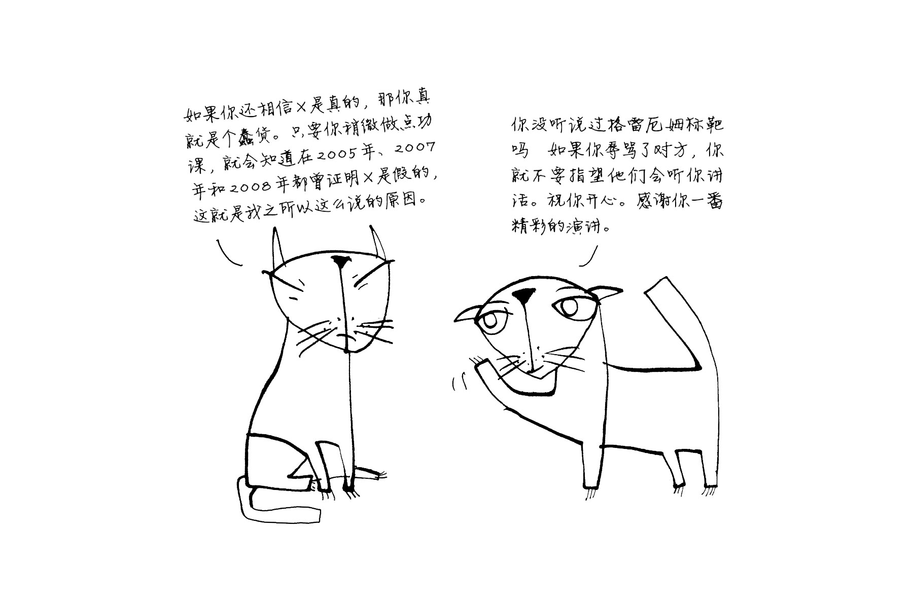

- modify 用于抽象变化、change 用于具象变化。 #区分英文单词
- #选题
	- 小红书+博人眼球的历史故事+GPT+AUTOMA #副本
	- 知乎+好物/视频+GPT+AUTOMA #副本
	- 独立开发 #副本
- #任务
  collapsed:: true
	- DONE 跟进文本按需滚动的需求实现情况并更新到现场 #任务
	  SCHEDULED: <2023-08-18 Fri 14:00>
	- DONE 发布Voerka2.5.33.78_Beta2 #任务 #cost=0.5h
	- DONE 根据最新需求调整信发1.4概要设计及任务分解 #任务 #cost=0.5h
	  :LOGBOOK:
	  CLOCK: [2023-08-18 Fri 08:59:44]--[2023-08-18 Fri 10:09:12] =>  01:09:28
	  :END:
	- DONE 支持紧急呼叫过程推送（开始仍保持不推送）#任务 #cost=1.5h
	  :LOGBOOK:
	  CLOCK: [2023-08-18 Fri 08:59:30]--[2023-08-18 Fri 09:49:15] =>  00:49:45
	  CLOCK: [2023-08-18 Fri 10:09:24]--[2023-08-18 Fri 10:23:16] =>  00:13:52
	  :END:
	- DONE 检查述职报告逐字稿 #任务 #cost=0.5h 
	  SCHEDULED: <2023-08-18 Fri 16:15>
	  :LOGBOOK:
	  CLOCK: [2023-08-18 Fri 13:06:53]
	  :END:
	- [modify 和 change 的区别](http://www.differencebetween.net/language/words-language/difference-between-modify-and-change/) modify 用于抽象变化、change 用于具象变化。 #英语
	- DONE 协助 YJ 排查现场虚拟机无法 ssh 访问的问题 #任务 #cost=0.5h
	  :LOGBOOK:
	  CLOCK: [2023-08-18 Fri 20:15:52]--[2023-08-18 Fri 20:15:52] =>  00:00:00
	  :END:
	- 如何逃出运行模式为`privileged=true`的容器：
	  1. 在容器中运行立即停机命令`shutdown -h now`；
	  2. 使用`alt`+`f2`快捷键切换到另一个终端（tty），登录到宿主机；
	  3. 在宿主机上，停止这个容器，修复相关问题。
	  #Linux #Docker #选题
	- DONE 跟进数据对接测试环境实现和交接情况 #任务 #cost=0.5
	  :LOGBOOK:
	  CLOCK: [2023-08-18 Fri 16:05:23]--[2023-08-18 Fri 16:05:24] =>  00:00:01
	  :END:
	- DONE 参与技术委员会主题讨论 #任务 #cost=2h
	  :LOGBOOK:
	  CLOCK: [2023-08-18 Fri 20:12:58]--[2023-08-18 Fri 20:12:59] =>  00:00:01
	  :END:
	- DONE 排查汕头联调过程反馈问题 #任务 #cost=1.5
	  :LOGBOOK:
	  CLOCK: [2023-08-18 Fri 20:21:08]--[2023-08-18 Fri 20:21:09] =>  00:00:01
	  :END:
	- 编写使用许可授权操作流程并告知相关人员。#任务 #cost=0.5h 
	  collapsed:: true
	  使用许可授权流程：
	  1. 确保平台可用，并在系统设置→平台设置→授权管理中，复制其序列号
	  2. 进入设备中心→设备授权，右侧选择“使用许可授权”，勾选所需使用许可授权的设备，点击导出，下载“使用许可授权.xlsx”到本地
	  3. 【这一步可能要指导商务人员操作】进入商务版“许可管理网站”→生成激活码→设备类型选择“沃尔卡服务器”→接入平台选择“沃尔卡平台”，导入第2步的“使用许可授权.xlsx”→其它信息（如到期时间、到期限制等）根据测试需要设定→确定→选择刚才生成的激活码→添加证书→在设备序列号中填入第1步复制的序列号→确定→下载证书到本地
	  4. 在平台上导入第3步获得的证书
	  5. 重启所需授权的设备确认是否可用（这一步有跟产品确认，产品说就这样）
- #参考
  collapsed:: true
	- [modify 和 change 的区别](http://www.differencebetween.net/language/words-language/difference-between-modify-and-change/) #区分英文单词
	- [修改logseq文字格式的代码合集](https://www.bilibili.com/read/cv15103422/)
	   #使用Logseq
	- [Logseq快速入门-字体|字号|颜色|行间距修改](https://zhuanlan.zhihu.com/p/463188749)
	   #使用Logseq
	- [自己动手修改 Logseq 主题](https://cloudlet.info/2022/modify-logseq-theme-by-yourself)
	   #使用Logseq
	- [高频需求：字体颜色、背景颜色](https://cn.logseq.com/t/topic/206)
	   #使用Logseq
	- [一个比较完整的Logseq入门指南](https://www.heithon.fun/%E5%AE%9E%E7%94%A8%E5%B7%A5%E5%85%B7/Logseq%E5%85%A5%E9%97%A8/)
	  #使用Logseq
- #阅读
  collapsed:: true
	- >举一个简单的例子，辩论者认为他面前的人品味不好，因为在这家伙展示自己一系列观点的幻灯片里，每一页都是紫色背景配上花园小雕像的插图，字体还用的是Comic Sans MS。**对于热衷于批判的人来说，对演讲横加批评远比关注信息的实质内容更有吸引力，特别是当信息非常混乱的时候。**于是就有了下面这样的评论：“当你的PPT是这个样子的时候，我很难认真去听你到底说了什么。”
	  **这种回应对方论据的方式，就是以对方缺少魅力，拼写糟糕，甚至是他的服装古怪为由而对他不理不睬。这些都不是对其言论不感兴趣的充分理由。**
	  
	  诚然，对方的对其论点的表现形式可能在主观上没有达到我们的要求（例如字体不讨好）或者在客观上不能达到应有的水平（例如格式混乱，会经常遇到）。但是，如果我们能在这种形式不合情况下仍能保持理性和克制，并且着眼于关注论题本身及其相关内容，并试着包容或改善其形式，那么我们会更容易接近真相并有所收获。
	  #《反驳的艺术》#形式攻击 #形式借口 #如何面对形式不合
	- >无论是在互联网还是在其他地方，书写技能还具有社会选拔的功能，这一点在今天尤为突出。然而，拼写绝非一个用来评估智力或者决定对方能否参与辩论的标准。**如果一个人声称有证据表明人类从来没有在月球上行走过，那么哪怕他的拼写不准确，也应该礼貌地让他提供证据继续讨论。除非他的拼写妨碍到正确理解他所提供的证据，否则没有理由专门去提及他的拼写问题。**在这种情况下，不让他参加自己感兴趣的辩论实在让人难以接受。**正确的做法是帮助他修改拼写，以便让其他人理解他所提供的证据，而不是在还没有理解的情况下，一味贬低他说的内容。**#如何面对形式不合
	  请注意，我**不是想说辩论的内容、形式、拼写、语气等就不重要了，恰恰相反。****在一场辩论中，富有感召力和正确的表达都至关重要，它们也是展现个人魅力的方式。**You Tube上很多知识科普视频博主的成功主要就是依靠他们清晰又独特的交流形式。You Tube频道“DEFAKATOR”的视频博主就是最典型的例子，他每次录制都戴着面具，穿着奇装异服，尽可能让网友开心。频道“Horror Humanum Est”的视频博主在视频里只使用几种颜色，主要是黑色、奶油色和鲜红色，这让他的视频风格独一无二，在网上一眼就能认出来。至于克里斯托弗·米歇尔，他规定自己尽可能少地使用黑色和白色之外的颜色，从而形成了独特且容易辨认的视频风格。还有知名频道“Simplex Paléo”的视频博主亚历克斯·贝尔纳迪尼和他那些百穿不厌的夏威夷衬衫，让网友对他的视频百看不厌。#《反驳的艺术》#形式攻击 #形式借口 #形式重要 #成功IP #案例
	- >**在社交网络或者其他地方，很多人提出了非常好的论据，但总忍不住在其中夹点脏话，这样一来，即使他们的论据可能很好，但还是瞄中了格雷厄姆标靶的外环。**自从2019年初，我在You Tube上介绍了格雷厄姆标靶后，我发现了一个有趣的现象：**有些标靶的爱好者，面对对方的辱骂后，即使对方还有其他论据，也以标靶为借口不再听对方说话了。**于是就出现了下面图片里两只猫咪的对话。
	   
	  然而，**以对方瞄中了格雷厄姆标靶的外环为借口避开他的实质论点……这就是一种对形式的攻击，会让自己错过靶心。**在这场交谈中，真正错的是右边的猫咪。左边的猫咪说了X是假的已经被证明了3次，而右边的猫咪对它说的话毫不感兴趣，更像是故意回避这个话题。
	  在对方表达了具有实质内容的信息后，无论对方多么恶意满满或者咄咄逼人，以标靶为借口来结束交谈都是不对的。如果对方瞄中了格雷厄姆标靶的不同地方，那么首先记住其中离靶心最近的内容。即使对方很无礼，也要保留他最好的论据，这样你可以就此延伸讨论，并且缓和气氛。
	  **当然，如果一个人最好的论据就是攻击对方，那就没必要继续对话了。**
	  #《反驳的艺术》#形式攻击 #形式借口 #案例
	- >尽量减少书写错误，表现得富有感染力，使用合适的语气，声情并茂地演讲，结构清晰地表达观点，这些都很重要。**理由很简单，这样可以减少被他人攻击形式的风险。** #《反驳的艺术》#预防形式攻击
	- >本书和格雷厄姆标靶都想要传递的信息是：
	  1. 宽容对待别人在形式方面的错误，不是因为人无完人，而是因为只有实质内容才真正作数。
	  2. 保护自己不受到对形式的攻击，但更重要的是，保证自己不对其他在这方面犯错的人进行形式攻击。
	  需要注意的是，最后这条建议不是让你不对任何论据形式进行批评。事实上，你应该毫不犹豫地帮助别人进步，减少其他人成为这类攻击的受害者的概率，因为在交谈中一旦出现了对形式的攻击，就会产生巨大的影响。不过，这件事要私下里友善地进行，绝不能在公开场合摆出一副高傲的姿态，让对方难堪：那样的话，你并没有帮助对方避免形式的攻击……你自己就犯了这个错误！
	  #《反驳的艺术》#形式攻击 #形式借口 #面对形式不合 #预防形式攻击
	  >预防对形式的攻击
	  为什么我像躲避瘟疫一样介意Comic Sans MS字体，还建议其他人和我一样这么做？为什么我每个月都要花几个小时重新复习一下拼写规则，尽管我并不能从中获得乐趣？为什么当我要在公众面前演讲时，我会关心我的着装和发型？为什么这本书里会出现猫咪？为什么格雷厄姆标靶是彩色的，而我却只能以一种朴实无华的学术风格来撰写这本书呢？这些问题的答案就和辩论一模一样：因为如果不在意这些标准，别人就有可能指责我。因为如果我不努力让这本书变得有趣，提高我的语言感染力，别人就有可能用这一点攻击我，以此为由让我退出讨论。因为如果我的书里全是错误，别人就有可能拿这一点抨击我，而且这本书也不会有人愿意看了。
	  在理想的世界里，不会出现攻击形式这种情况。我们都会非常有耐心，我们会有很多时间，我们也会暂且抛开一些人品味不行或者魅力不够的想法，而去倾听他们信息的实质内容。可惜我们不是生活在这样的世界，但我们可以一起努力朝这个方向改变。鉴于我们现在生活的世界里有很多对形式的攻击，为了预防这种事情的发生，让自己做到无可指摘就非常重要：注意自己的外表、表达、拼写、语气，不断提升个人魅力。
	  
	  总的来说：**除非自己足够强大，否则在公开场合的表达形式上应尽量保持主流风格、迎合主流需求。**
	  #《反驳的艺术》#形式攻击 #形式借口 #预防形式攻击