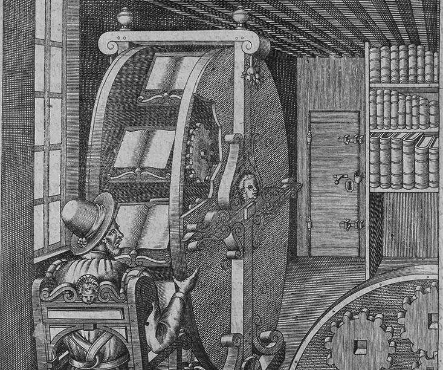

- [[2023年08月21日]] 任选一本书，一句话概括这本书 #任务 #一句话概括一本书 #推荐书
-
- 参考“你的消息APP” #微信自定义消息提示工具 #开发 #选题
- [用 Git 在 Android 和 Windows 间同步 Obsidian 数据库](https://sspai.com/post/68989) 同样适用于 Logseq 等知识库软件。#Logseq-跨平台同步
- DONE 如何定义一个信息块的标签？#任务 #Logseq-使用 #信息块 #标签 #选题
- 信息块标签的定义要点：#Logseq-使用 #信息块 #标签 #选题
	- 1. 以信息块内容中出现的词作为标签，形式大于意义实用，因为：即使不做这个标签，这个信息块也会出现在以这个词命名的页面的“无链接引用区”（Unlinked Reference）。注意：图谱里面不会为一个页面链接其“无链接的”页面，这在逻辑和语义上也是通顺的。所以：如果看重形式（包括页面形式和图谱形式），或者只是习惯使然，那么可以做这样的标签。
	- 2.以信息块内容的可能使用场景、涉及思维模式、所用修辞手法、……等其实用目的或处理过程相关词作为标签，有助于在使用场景中快速调用、扩展自己的思维模型、发现信息之间的内在联系等。注意：在使用这种处理过程相关的词作为标签时，必要时应在其关联位置说明具体的思考处理过程，否则过后往回审视这个标签时可能会一头雾水。
- 图谱的使用及其分析目的是激发创新。#图谱 #图谱分析 #创新
- LATER 如何使用图谱分析激发创新 #任务 #Logseq-使用 #图谱 #图谱分析 #创新 #选题
- DONE 如何使用图谱 #任务 #Logseq-使用 #图谱 #选题
- 图谱的使用方法：#Logseq-使用 #图谱 #图谱分析 #相关度 #相关度算法 #算法 #Adamic-Adar算法 #Cocitation算法 #选题 #数学 #统计学 #案例
	- 直接使用图谱，直观地发现两个事物（页面）之间直接的联系
	  logseq.order-list-type:: number
	- 使用图谱分析软件，分析两个事物（页面）之间隐秘的联系
	  logseq.order-list-type:: number
	- 例如：使用 logseq-graph-analysis 插件 进行图谱分析：
	  logseq.order-list-type:: number
	  1) 点击一个事物的节点，获知与该事物关联的其它各个事物的相关度。
	  2) 切换到 Adamic-Adar 算法，分析两个事物共同的特征
	  3) 切换到 Cocitation 算法，分析两个事物共同的场景
	  4) 切换到 Shortestpath 试图，分析两个事物最短的联系路径
	- 事物相关度的两种算法：
	  logseq.order-list-type:: number
	  1) Adamic Adar 算法：关注两个事物所关联相同事物的个数（类似于有多少相同朋友，拥有共同的特征）。适用于：分析两个事物共同的特征。
	  2) Cocitation 算法：关注两个事物被同时引用的次数（类似于被同时提起多少次，存在共同的场景）。注意：这个“引用”可以是在标签中也可以是内容里。适用于：分析两个事物共同的场景。
	- 事物相关度的两种算法实践对比：
	  logseq.order-list-type:: number
	  
- >我们的第一大脑在绝大多数情况下，会满足于获得印象，拒绝思考。第一大脑好像与生俱来就拥有一个错觉：认为凡事只要我们拥有了印象——只要我们记得，就认为“我们懂了”，甚至是“我们理解了”“我们掌握了”。事实上，从“印象”到“认识、理解和掌握”的道路是非常遥远的，也是非常崎岖的，而许多人不过是这里走走、那里看看的漫游者。因为懒散、软弱、没有毅力，永远停留在“印象”附近，无法抵达真正的“认识和掌握”。
  #《第二大脑》 #记住不等同于理解 #大脑的错觉 #大脑 #错觉
- >思考的目的是去认知、去理解、去掌握事物的本质。德国哲学家卡尔·马克思（Karl Marx，1818—1883）甚至认为，事物的本质，就等于它和其他事物关系的总和。所以只要掌握了它和其他事物的关系，就能掌握事物的本质。
  #《第二大脑》 #思考 #思考的目的 #事物的本质 #本质
- >我常常在一个主题反射区（页面）接近于丰满、完善的时候，调看其页面的图谱，类似这样的发现让我对一个反射区和其他反射区的关系加深了认识，加快了一个反射区成熟的过程。#《第二大脑》
  
  **图谱要持续调整和修剪。**#Logseq-使用
- >**创新的能力，现在已经被认为是现代人最本质的能力，也就是拉开人和人之间的差距、体现人和人之间最本质不同的一种能力。**
  **法国思想家米歇尔·福柯（Michel Foucault，1926—1984）甚至认为，现代性的定义就是人类永不停止的自我创造，而现代人最根本的特征就应该是创新。**
  **在此之前，我们评价人和人之间的差异，一般会从两个层次来考察。**
  **第一个层次是感官**，即感觉，在这个方面，只要先天健全的人，差别都不会很大。
  **第二个层次就是记忆和思考的能力，这个层次也可以概括成一个词：理性。**在这个层次上，人和人之间的差别就比较大了，人类发现导致这个差别比较大的主要原因，不是先天的基因，而是后天的教育和培训，也就是说只要接受足够的教育，人和人之间在这方面的差异就不会很大，随着最近100年世界的发展，学校和义务制教育在很多国家都陆续普及，应该说，人类在理性方面的差异在缩小。
  但人类又发现，**即使在受过良好教育的人中间，他们在创新能力方面的差异也非常大，有少数人表现出极强的创新能力，而大部分人只会按部就班，完全不具备任何创新的能力**，这究竟是怎样发生的，心理学家、教育家、科学家至今都还给不出清晰的解释和答案。
  **人和人区别的三个层次：感觉→理性→创新性。**
  #《第二大脑》
- >第二大脑可以帮助第一大脑减负，让第一大脑专注于思考和创新。
  第二大脑可以帮助第一大脑看到更多的信息。
  #《第二大脑》
- >创新大师史蒂夫·乔布斯曾经说过：**人类创造的本质，只是将不同的事物联系起来，这个联系越是意想不到，创造出来的东西就可能越有意思。**
  很多人之所以能够创新，就是因为他能发现别人发现不了的联系和关系。
  知识从一开始，就不仅是对事物本质的认识，也是对一件事物和其他事物之间所有关系和联系的洞察和认识。
  人类历史上真正伟大的知识分子，例如人类公认的亚里士多德、柏拉图、莎士比亚、歌德、牛顿、爱因斯坦等，就是那些能将新与旧、过去与现在、远与近联系在一起的人，就是那些能够洞见所有事物之间互相关系和影响的人，他们不仅具有对事物本身的知识，而且还具有事物间的相互作用和真实关系的知识。
  #《第二大脑》
  >第一个经验是第一大脑要经常回访第二大脑
  第二个经验是要“盯着看”。以神经中枢为单位，对反射区一个一个进行整体浏览，在想象中和这些信息对话。
  第三个经验是保持诵读的习惯。
  #《第二大脑》 #激发思考 #激发创新
  >物理大师牛顿（Isaac Newton，1643—1727）的一句话，是这样说的：我始终把思考的主题像一幅画一样摆在我的面前，再一点一线地去勾勒，直到整幅画慢慢地凸显出来。这个过程需要长期的安静与不断地默想。
  #《第二大脑》 #激发思考 #激发创新
  >在工业时代之前，人类就为能同时看到更多的信息做了很多努力。图3-14是欧洲的工程师在1588年发明的“书轮”，它通过转动轮子让阅读者能在多本书的不同信息之间进行切换浏览，以激发思考。
  #《第二大脑》 #激发思考 #激发创新 #案例
  
- >Logseq使用的是Datalog数据库和Clojure查询语言，Clojure具有和流行的SQL（结构化查询语言）很相似的表达，即使是高级、复杂的功能，借助在线手册也很容易学会。Logseq还在2022年宣布过他们正在开发一个智能化的工具，可以基于你说的话（即语义），来为你自动生成高级复杂的Query语句。
  #《第二大脑》 #Logseq-使用
- >提炼出8点日常技巧以供参考，试着娴熟掌握这些搜索技能，我们就可能会和一些原来永远都不可能看到的信息不期而遇。
  #搜索 #技巧 #搜索技巧 #选题
  （1）【关键词+特定数字】把关键词和一个特定的数字结合起来搜索，即把数字也当作关键词来搜索。包含一个关键词的结果会有很多，但同时包含一个特定数字的结果就会少很多很多，这意味着更快更准。
  （2）【关键词+分析术语】对一些有争议的问题，可以把争议的关键词和“数据”“回归分析”“因果”“关联”这些词放在一起搜索，结果中可能会有一些高质量的实证分析。
  （3）【K1 | K2 = 搜索 K1 且另外搜索 K2】如果你想同时搜索两个关键词，但这两个关键词并不连贯，这时候你就可以用并行搜索，格式是：A | B。比如，搜索两个关键词：大数据|社会治理。
  （4）【"K" = 搜索完全匹配 K】把关键词放在双引号中，代表完全匹配搜索，也就是说，搜索结果返回的页面包含双引号中出现的所有词，连顺序也完全匹配，这样可以提高搜索的精准度。
  （5）【K1 -K2 = 搜索 K1 且其中不包含 K2】当你想要搜索出来的结果只含关键词A而不含关键词B时，只要输入：关键词A（空格）–关键词B，例如：大数据–保险。
  （6）【intitle: K = 搜索标题包含 K】有的时候，我们只想从文章的标题中搜索，即找到包含一些关键词的标题，可以用“intitle”这个指令，例如：intitle：大数据。这样出现的是标题含有“大数据”三个字的文件。
  （7）【K filetype: F = 搜索匹配 K 的 F 类型文件】有一些专题文件特别有用，例如pdf格式的论文。我们可以快速找到这样的文件类型，例如在搜索框中输入“大数据filetype: pdf”，表示含有“大数据”的类型为pdf的文件。
  （8）【K site: S = 搜索匹配 K 的 S 来源】也可以指定来源搜索，例如：在搜索框中输入“大数据site: zhihu.com”，表示在知乎站内搜索“大数据”；还可以指定网站类型搜索，比如edu、gov等；如果需要搜索一篇学术论文，可以输入“大数据edu filetype: pdf”，这样就能找到大学网站的pdf格式的学术论文；如果需要政府文件，就输入“大数据gov filetype: pdf”。
- >记忆是一回事儿，思考是另外一回事儿，从印象到理解、掌握中间隔着一段很长的距离，不经思考难以抵达。所以，如果我们仅仅停留于摘录，那就是一种糟糕的学习方法。我们摘录的是好东西，但是是别人思考的成果，这就好比搭别人的车，是别人带我们走，我们自己被免除思考的责任，自然很轻松，但要是问一个人从A到B的路怎么走，搭车的人是说不清楚的，开车的人才知道，因为开车的人必须要盯住路，不断地思考判断，否则会错过拐弯，走错路。
  #《第二大脑》 #记住不等同于理解
- >德国的思想家亚瑟·叔本华（Arthur Schopenhauer，1788—1860）对此有精彩的论述，他甚至认为，**读书——如果仅仅是读——那就是对思考能力的一种破坏，读书不思考，其实读得越多越糟糕**：
  我们读书时，是别人在代替我们的思想，我们只不过是重复他人的思想活动的过程而已，犹如儿童启蒙习字，用笔按照别人所写的笔画依葫芦画瓢，我们的思想活动在读书时被免除了一大部分，因此我们暂不自行思索而拿书出来读时会觉得很轻松。然而，在读书时，我们的头脑实际上成为别人思想的运动场了，所以读书越多或整天沉浸于读书的人，虽然可以借以修养精神，但他的思维能力必将逐渐丧失，犹如时常骑马的人，其步行能力必定较差，道理相同。许多学者就是这样，因读书太多而变得愚蠢。一条弹簧，常受外物的压迫会失去弹性，我们的精神也是一样，如常常受到别人思想的压力，也会失去思考的弹性，食物虽能滋养身体，但吃得过多则反而伤胃乃至全身，我们的精神食物如太多也是无益。读书越多，留存在脑中的东西越少，两者是成反比的。读书多，他的脑海就像一批密密麻麻、重重叠叠、涂抹再涂抹的黑板一样。读书而不加以思考，绝不会有心得，即使稍有印象也浅薄而不生根，大体在不久后又会淡忘丧失。
  #《第二大脑》
  >如果过多地用摘录来填充我们的第二大脑，我们拥有的将仅仅还是一个数字化的剪贴本、一个信息的记忆库，而不是一个真正的具有“思考”能力的大脑。
  必须对摘录进行思考和改造。改造的方法就是——**按照你可能要使用的语境，用你自己的理解和语言重述这段话的意思**，把它改造成具有你自己个性的、新的、不会排异的大脑“神经元”。
  #《第二大脑》 #复述
- >摘录太容易，很多时候一摘了之，但要**把摘录的内容用自己的话写下来**，这就不容易了，这**可以检验我们是不是真的理解了我们想得到的东西**，在这个过程中，我们常常会发现，有一些内容我们并没有真的理解，我们必须回头去咀嚼摘录的内容，这是一个过程——这个过程有的时候可以一次完成，有的时候则必须经历多次。
  任何时候巡视自己的第二大脑，只要看到摘录，只要有时间，我就会停下来再一次对比原文和自己的改写，看到不满意的地方，就继续改，这个过程不断重复，直到自己对改造的结果满意为止，这个过程才算真正完成。如此反复，也有助于我们把所摘录的东西跟我们大脑中已有的知识体系融合到一起。
  #《第二大脑》 #复述
- >这个方法最早的总结来源于美国的开国元勋之一的本杰明·富兰克林（Benjamin Franklin，1706—1790），富兰克林出身于普通人家，小时候就到他哥哥经营的印刷工厂做童工，工厂印的是报纸，富兰克林喜欢读报，他看到好的文章，就会反复地读，然后把报纸合起来，根据记忆和自己的理解在纸上重写这篇文章，刚开始他只能写一点点，写不出来了就再打开报纸看，然后又合上报纸继续写，直到把全篇文章都写完。
  他在自己的传记中记录了这个方法：
  恰好这个时候，我看到《旁观者》一书残缺不全的第三卷，我以前从未见过这本书，于是便把它买了下来，读了一遍又一遍。得到这本书对我来说是莫大的喜悦，我觉得这本书写得非常精彩，有可能的话，我想模仿它。有了这个想法以后，我便先从书中选了几篇文章，为每一句做了摘要，然后把它们搁置了几天，之后在不看原文的情况下，试着把原文复述出来，用自己所能想到的词汇和摘要重新构建整篇文章，尽量使它和原文一样；最后我再把它和原文对照，发现错误并进行订正
  。
  但我发现我的词汇量少得可怜，也可以说是不能在脑海里迅速地搜罗到最恰当的词，也许如果我原来继续写诗的话，我的词汇量现在会很丰富，因为写诗时需要寻找词义相同但长短不同的词汇，去适应诗的韵律，这会训练我不断地在脑海里搜寻各种形式的词语，并能随心所欲地使用它们。因此我把其中的一些故事改写成诗，一段时间以后，当我差不多忘了原书内容的时候，我又把它们重新还原。
  有时候我也把我写的摘要打乱，过了几星期再试着把它们用最恰当的顺序组织起来，形成一篇完整的文章。我这样做是为了学会构思，然后通过和原文比较，我发现了错误并加以改正
  。有时候我会很高兴地幻想，我的语言和条理在一些不太重要的地方比原文更好，这种幻想足以鼓励我相信自己在未来可以成为一个不算糟糕的作家。
  （《富兰克林自传》，北京联合出版公司，2015年）
  **这种方法可以叫复述。或者叫仿写。**富兰克林使用这种方法，很快就可以给报纸写社论了。当他向他哥哥投稿的时候，他担心自己还是个孩子，他哥哥肯定嗤之以鼻，看都不会看他的稿子，富兰克林只好匿名投稿，直到他的作品发表了一年以后，别人才知道他的真实身份：
  我怀疑哥哥如果知道稿子是我写的话，绝不会发表它的。所以我就设法隐藏自己的笔迹，写了篇匿名的稿子。晚上的时候，我把稿子塞到印刷所的门下。第二天早上，稿子被人们发现了，当哥哥的朋友像往常一样来拜访的时候，稿子就在他们中间传看。他们阅读了我的稿子，大大地赞扬了一番，这些都进了我的耳朵。我非常高兴，我的稿子能够得到他们的认可，他们猜测谁是这篇文章的作者，他们猜的人都是镇上一些博学和聪慧之人。
  #《第二大脑》 #复述 #仿写 #互文 #案例
- >把这个方法总结得最系统、最全面的要数德国的学者尼古拉斯·卢曼（Niklas Luhmann，1927—1998），卢曼也出生于一个普通家庭，他的父亲是一名酿酒师，卢曼年轻时参加过第二次世界大战，还被俘虏过，战后他成为一名普通的公务员。卢曼喜欢在业余时间读书，而且勤于记录，发明了一套后来被称为“卡片盒”（Zettelkasten）的笔记方法。正是依靠这个方法，这位年轻的公务员在业余时间写出了若干论文。当他把这些文章寄给一位大学教授之后，这位社会学教授大加赞赏，认为他已经具备了在大学教书的见识和水平，而卢曼当时没有受过社会学的专门训练，也没有博士学位，按通行的标准，他就连做教授助手的资格都没有。但在这位教授的推荐下，卢曼真的去了一所大学担任教师，接下来他用了一年的时间就完成了博士论文。到1968年，卢曼被正式聘为比勒菲尔德大学的社会学教授，并且终身担任这一教职。卢曼以学术高产著称，在他成为教授之后的30多年中，他总共出版了58本著作和数百篇文章，其中不少作品在当时都获得了赞誉，卢曼本人也被视为欧洲当时重要的社会学家。
  **卢曼的“卡片盒”方法强调的是，每读到有价值的信息，就要为它做一张卡片，但他“拒绝做知识的搬运工”，从来不照抄，而是根据自己的语境对读到的信息进行“改写”和“翻译”**，相关主题的卡片再通过他自己发明的索引方法集结起来，成为他学术研究、论文写作的重要参考和来源。卢曼的“卡片盒”做法影响很大，被总结成书Howto take smart notes，中译本叫《卡片笔记写作法》（人民邮电出版社，2021年），本书的写作也从卢曼的经验中获益很多。
  #《第二大脑》 #复述 #仿写 #互文 #卡牌盒笔记法 #案例
  > 富兰克林的仿写和卢曼的改写，在当代文学理论里，也有一个对应的方法，而且有个时尚的名字，叫“互文”（the theory of intertextuality）。
  #《第二大脑》 #复述 #仿写 #互文
- >美国加州大学洛杉矶分校的童明教授和我在一个微信群。他为木心辩护，反对这种指控，认为木心的做法不是抄袭，而是“互文”，但国内对互文理论不太了解。童明教授解释说，互文是指对别人文本的改写，这是一种化用；事实上，文本就像一个纺织品，都是混纺的，认定某种真理性的话语或思想有一个纯粹和固定的起源，这是一个迷思，其实根本没有这样的起源；读书的人要敢于去化用前人的成果，化用得好就是创新，对于文学作品而言，并不需要指出来源，处处注明出处会影响读者的阅读感受；文学之路是公开的，也是永续的，如果化用得不好，或者完全是抄袭，专家和历史都会给出相应的评价，无法隐匿。童明教授的主要观点可以参考他的论文《文学虚构中的互文现象》（《海峡人文学刊》2022年9月号）。
  #《第二大脑》 #复述 #仿写 #互文 #互文不是抄袭 #案例
- >无论是富兰克林的复述、仿写，还是卢曼的“卡片盒”和改写，抑或是现代西方的互文理论，强调的都是要把别人的思想转换成自己的语言，在转换的时候，你可以结合你的人生经历、根据你的理解，对原文进行语境的转换，甚至是润色、美化和完善，当你尝试把同一个观点用不同的语言来进行表述，因为使用了新的词语、维度和语境，拥有了新的文字组合，这个过程就是创新，也有可能激发你的读者创新。
  #《第二大脑》 #复述 #仿写 #互文
- >碰到一些前人总结、书写的人生至理、千古金句，它们非常经典，读下来你一个字也不想改，也很难改。例如，前面这段叔本华关于读书和思考的论述，好得实在不需要任何修改，在任何情况下最好的选择都是“原文引用”。
  #《第二大脑》
  >2022年6月28日，我应邀在中山大学的毕业典礼上发表演讲，一年一度的毕业典礼是一件大事，学校要求在演讲前提交一份正式的演讲稿，我清楚地记得，我在确定演讲提纲之后，在第二大脑里面检索，只用了40分钟就完成了演讲稿的初稿。那次演讲收到了很好的效果和反馈，澎湃新闻在当天就全文发表了这篇演讲辞，人民网、《南方日报》等媒体随后进行了转载。
  #《第二大脑》 #复述的好处 #案例