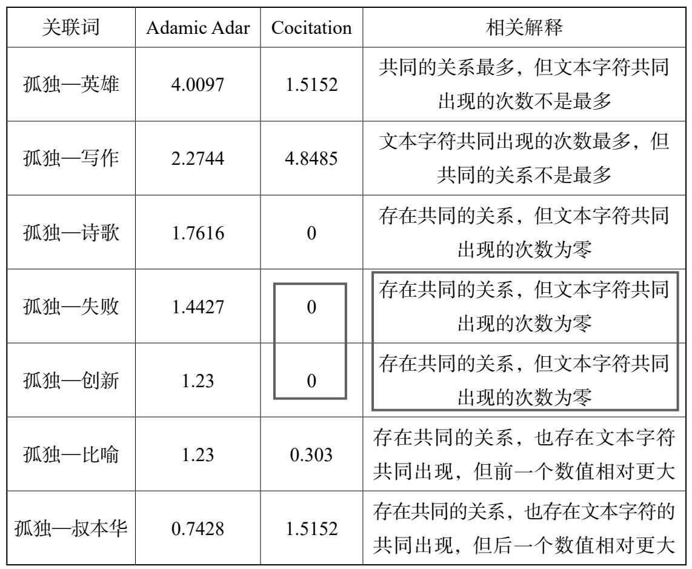

- 直接使用图谱，直观地发现两个事物（页面）之间直接的联系
  logseq.order-list-type:: number
- 使用图谱分析软件，分析两个事物（页面）之间隐秘的联系
  logseq.order-list-type:: number
- 例如：使用 logseq-graph-analysis 插件 进行图谱分析：
  logseq.order-list-type:: number
  1) 点击一个事物的节点，获知与该事物关联的其它各个事物的相关度。
  2) 切换到 Adamic-Adar 算法，分析两个事物共同的特征
  3) 切换到 Cocitation 算法，分析两个事物共同的场景
  4) 切换到 Shortestpath 试图，分析两个事物最短的联系路径
- 事物相关度的两种算法：
  logseq.order-list-type:: number
  1) Adamic Adar 算法：关注两个事物所关联相同事物的个数（类似于有多少相同朋友，拥有共同的特征）。适用于：分析两个事物共同的特征。
  2) Cocitation 算法：关注两个事物被同时引用的次数（类似于被同时提起多少次，存在共同的场景）。注意：这个“引用”可以是在标签中也可以是内容里。适用于：分析两个事物共同的场景。
- 事物相关度的两种算法实践对比：
  logseq.order-list-type:: number
  